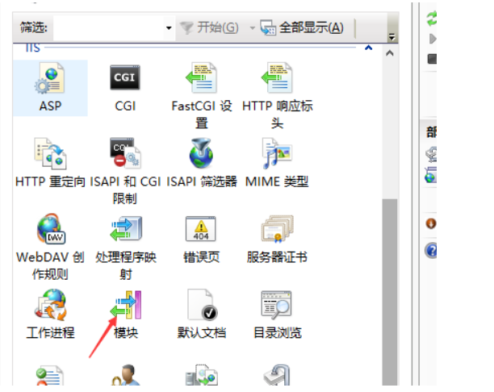
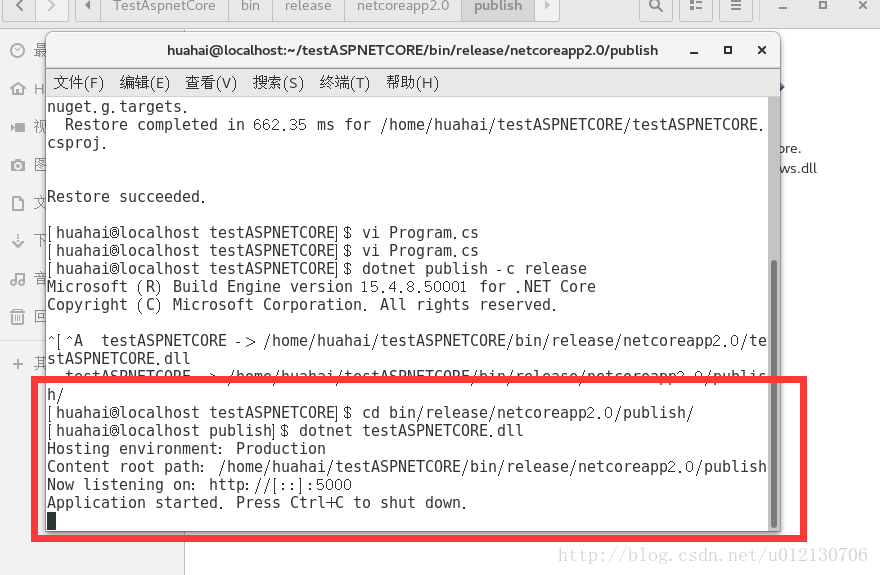
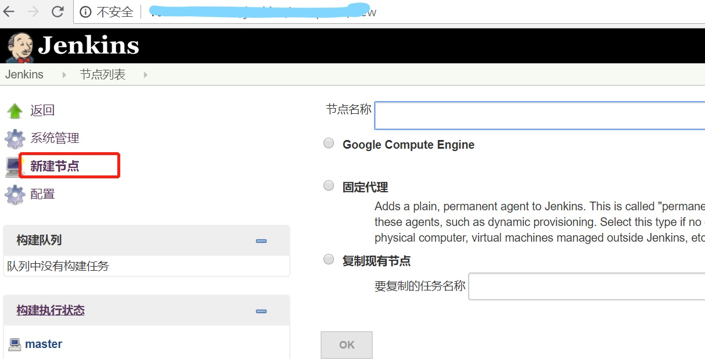
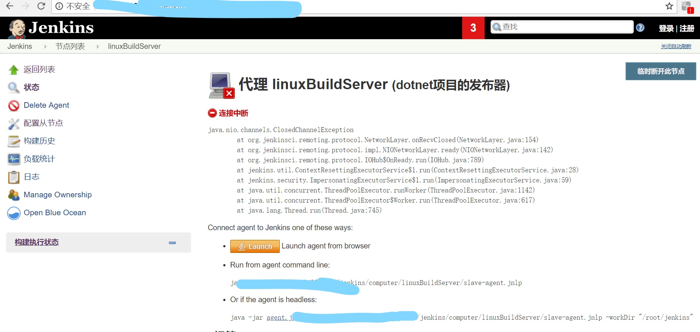
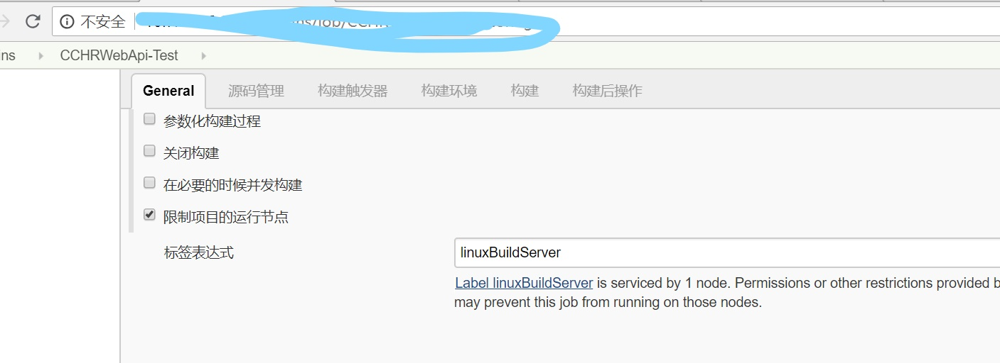
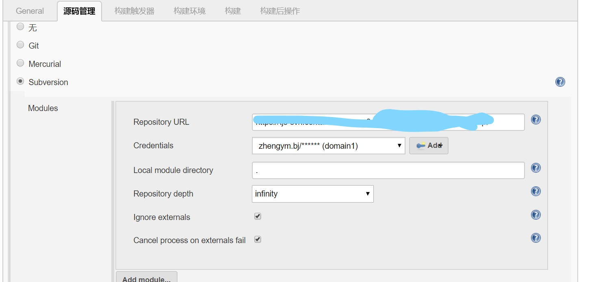
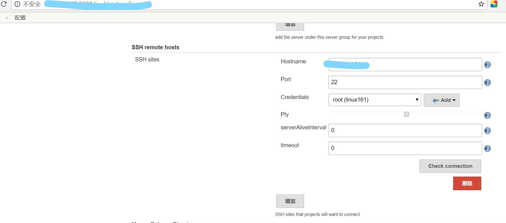
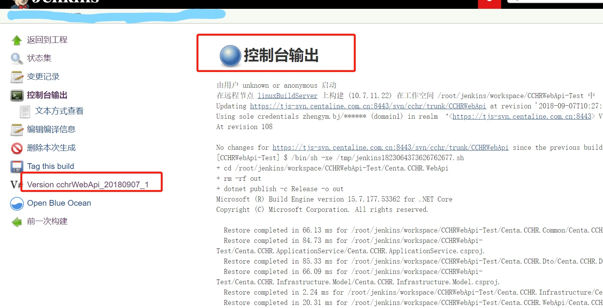

dotnet项目部署方案

一．Windows部署**.net Core 2.0.5**
==================================

1.  首先发布项目文件,点击网站项目右键 发布

发布后的文件

1.  安装AspNetCoreModule托管模块

1.  新建网站和之前建立没什么区别，应用程序池 最后选择 无托管代码 即可。

1.  也可以通过控制台应用发布网站，发布命令PM\> dotnet publish consoleapp1 -o
    D:\\Demo\\test 最后通过文件夹部署即可

**二．Liunx部署.net Core 2.0.5**
================================

1.  **安装CentOs(目前咱们服务器用的7.4版本)**

>   目前运维安装的，本地测试自己下载即可

1.  **安装.NET CORE SDK for CentOS 7.4**

>   为了安装.NET，需要注册微软签名密钥和添加微软相关的支持。这个操作每台机器只能做一次。

>   打开命令行，输出以下命令：

>   **sudo rpm --import** <https://packages.microsoft.com/keys/microsoft.asc>

>   **sudo sh -c 'echo -e
>   "[packages-microsoft-com-prod]\\nname=packages-microsoft-com-prod
>   \\nbaseurl=
>   https://packages.microsoft.com/yumrepos/microsoft-rhel7.3-prod\\nenabled=1\\ngpgcheck=1\\ngpgkey=https://packages.microsoft.com/keys/microsoft.asc"
>   \> /etc/yum.repos.d/dotnetdev.repo'**

>   **相关截图：**

1.  **添加.NET相关**

>   首先，更新可用的安装包；

>   然后，安装.NET需要的组件，libunwind和libicu库；

>   最后，安装.NET SDK。

>   分别对应下面的命令：

>   sudo yum update

>   sudo yum install libunwind libicu

>   sudo yum install dotnet-sdk-2.1.4

安装完成之后，可以用以下命令来检测是否安装成功。

dotnet –info

1.  **创建ASP.NET CORE应用程序**

>   首先，打开命令行，创建一个文件夹，用于存放应用程序，文件夹名称可以随便取，这里我命名为test。并且获得该文件夹的最高权限，便于后续操作。   
>   命令如下：

mkdir test

>   chmod 777 test

>   上传项目的文件到test文件夹下

>   cd test/webapi

>   dotnet testCORE.dll

>   这里写图片描述

>   直接加上当前服务器的IP，端口号就能访问了，如果不能访问；关闭防火墙，或者开启端口，或者找运维设置策略。

1.  **配置.Net Core Centos 守护进程配置**

5.1运行命令 yum install -y epel-release

yum install -y supervisor

>   5.2配置supervisor

>   5.3运行命令创建文件夹 mkdir -p /etc/supervisor/conf.d/

>   5.4运行命令创建配置文件echo_supervisord_conf \>
>   /etc/supervisor/supervisord.conf

>   5.5修改配置文件vim /etc/supervisor/supervisord.conf

>   5.6 在文件末尾添加，注意首尾需无空格，需顶格

>   [include]

>   files=conf.d/\*.conf

5．7创建配置文件

[program:HelloCore]

command=dotnet core.dll

directory=/www/wwwroot/www.wbf.com

environment=ASPNETCORE__ENVIRONMENT=Production

user=root

stopsignal=INT

autostart=true

autorestart=true

startsecs=3

stderr_logfile=/var/log/core.err.log

stdout_logfile=/var/log/core.out.log

5．8创建supervisor 自启动服务

vim /etc/systemd/system/supervisor.service

编辑内容

[Unit]

Description=supervisor

[Service]

Type=forking

>   ExecStart=/usr/bin/supervisord -c /etc/supervisor/supervisord.conf

ExecStop=/usr/bin/supervisorctl shutdown

ExecReload=/usr/bin/supervisorctl reload

KillMode=process

Restart=on-failure

RestartSec=42s

[Install]

WantedBy=multi-user.target

5.9 启动服务

//停止服务

systemctl stop supervisord

//启动服务

systemctl start supervisord

运行supervisord并查看

supervisord -c /etc/supervisor/supervisord.conf

到此为止配置完成。重启系统 core 程序也会自动运行了。

5.10 配置文件例子

三．Linux下docker方式部署
=========================

1.docker安装
------------

依次执行下列命令

sudo yum install -y yum-utils device-mapper-persistent-data lvm2

sudo yum-config-manager --add-repo
http://mirrors.aliyun.com/docker-ce/linux/centos/docker-ce.repo

sudo yum makecache fast

sudo yum -y install docker-ce

检查docker是否安装成功：

docker version

若成功显示如下：

加到linux开机启动项

sudo systemctl start docker

2.docker部署
------------

### 2.1上传文件到linux

在linux下创建文件夹CCHRWebAPI

mkdir CCHRWebAPI

用Xftp6把发布的文件上传到CCHRWebAPI

### 2.2添加Dockerfile文件

进入目录CCHRWebAPI

cd CCHRWebAPI

创建文件Dockerfile

vim Dockerfile

内容如下，说明：镜像里创建cchr文件夹，复制linux上的文件到镜像目录，对外暴露8050端口，运行程序

FROM microsoft/aspnetcore:2.0

RUN cd /usr/local/src

RUN mkdir cchr

WORKDIR /usr/local/src/cchr

COPY \*.\* ./

EXPOSE 8050

CMD ["dotnet", "Centa.CCHR.WebApi.dll"]

保存

**注意**：

如果要包含wwwroot，需要复制到镜像里，如：

FROM microsoft/aspnetcore:2.0

RUN cd /usr/local/src

RUN mkdir cchr

WORKDIR /usr/local/src/cchr

COPY \*.\* ./

COPY wwwroot ./wwwroot

Copy runtimes ./runtimes

EXPOSE 8050

CMD ["dotnet", "Centa.CCHR.WebApi.dll"]

### 2.3构建镜像

.表示当前目录，别丢了；镜像名字叫cchr-image，禁用缓存，否则迭代时会出问题

docker build --no-cache -t cchr-image .

### 2.4运行容器

用镜像cchr-image创建容器，指定容器名称是cchr-container，指定时区（否则用的是美国时间，相差8小时），容器里的8050端口映射到linux主机的8050端口，每次运行失败后自动重启

docker run --name=cchr-container -dp 8050:8050 --restart=always -e
LC_ALL="en_US.UTF-8" -e TZ="Asia/Shanghai" cchr-image

查看容器cchr-container的时间（可以不执行）：docker exec cchr-container date

打开浏览器访问：<http://10.7.11.22:8050/swagger/>

### 2.5发布更新

上面说的是第一次发布，后期迭代，需要把容器删除，再构建镜像，运行容器。

#### 2.5.1删除容器

docker container rm -f cchr-container

#### 2.5.2构建镜像&运行容器

参考2.3和2.4

3.docker Registry方式部署
-------------------------

### 3.1仓库服务器

#### 3.1.1搭建私有仓库

10.7.11.22已经部署了私有仓库，其部署步骤如下：

编辑文件daemon.json

vim /etc/docker/daemon.json

仓库地址10.7.11.22:5000，内容如下

内容如下{ "insecure-registries":["10.7.11.22:5000"] }

保存

重启docker

systemctl daemon-reload && systemctl restart docker

安装Registry，自动重启，对外5000暴露端口

docker run -d -p 5000:5000 --restart=always --name registry registry:2

#### 3.1.2发布镜像到仓库

**CCHR：**

上传CCHR发布后的文件到linux相应目录，进入该目录，构建最新版本镜像（禁用缓存，否则迭代时会出问题），打标签，指定当前版本如1.0.0，便于回滚，推到仓库里

docker build --no-cache -t cchr-webapi .

docker tag cchr-webapi cchr-webapi:v1.0.0 && docker tag cchr-webapi
localhost:5000/cchr-webapi && docker tag cchr-webapi
localhost:5000/cchr-webapi:v1.0.0

docker push localhost:5000/cchr-webapi && docker push
localhost:5000/cchr-webapi:v1.0.0

**安家趣花：**

上传安家趣花发布后的文件到linux相应目录，进入该目录，构建最新版本镜像（禁用缓存，否则迭代时会出问题），打标签，指定当前版本如1.0.0，便于回滚，推到仓库里

docker build --no-cache -t ajqh-webapi .

docker tag ajqh-webapi ajqh-webapi:v1.0.0 && docker tag ajqh-webapi
localhost:5000/ajqh-webapi && docker tag ajqh-webapi
localhost:5000/ajqh-webapi:v1.0.0

docker push localhost:5000/ajqh-webapi && docker push
localhost:5000/ajqh-webapi:v1.0.0

### 3.2 客户端

用10.69.1.161做测试

#### 3.2.1编辑daemon.json

如果是第一次使用Registry方式，需要编辑文件daemon.json

vim /etc/docker/daemon.json

仓库地址10.7.11.22:5000，内容如下

{ "insecure-registries":["10.7.11.22:5000"] }

保存

重启docker

systemctl daemon-reload && systemctl restart docker

#### 3.2.2删除已有容器和镜像

如果linux上有运行的容器和存在的镜像，先删除，没有就不用执行

**CCHR:**

docker container rm -f cchr-container && docker image rm -f
10.7.11.22:5000/cchr-webapi

**安家趣花：**

docker container rm -f ajqh-container && docker image rm -f
10.7.11.22:5000/ajqh-webapi

#### 3.2.3从仓库拉镜像并运行容器

**CCHR:**

用镜像10.7.11.22:5000/cchr-
webapi创建容器，指定容器名称是cchr-container，指定时区（否则用的是美国时间，相差8小时），容器里的8050端口映射到linux主机的8050端口，每次运行失败后自动重启

docker run --name=cchr-container -dp 8050:8050 --restart=always -e
LC_ALL="en_US.UTF-8" -e TZ="Asia/Shanghai" 10.7.11.22:5000/cchr-webapi

打开浏览器访问：
[http://10.69.1.161:8050/swagger/](http://10.7.11.22:8050/swagger/)

如果要回滚到某个版本，指定版本即可，如：

docker run --name=cchr-container -dp 8050:8050 --restart=always -e
LC_ALL="en_US.UTF-8" -e TZ="Asia/Shanghai" 10.7.11.22:5000/cchr-webapi:v1.0.0

**安家趣花：**

用镜像10.7.11.22:5000/ajqh-
webapi创建容器，指定容器名称是ajqh-container，指定时区（否则用的是美国时间，相差8小时），容器里的8070端口映射到linux主机的8070端口，每次运行失败后自动重启

docker run --name=ajqh-container -dp 8070:8070 --restart=always -e
LC_ALL="en_US.UTF-8" -e TZ="Asia/Shanghai" 10.7.11.22:5000/ajqh-webapi

打开浏览器访问：
[http://10.69.1.161:8070/swagger/](%20http://10.69.1.161:8070/swagger/)

如果要回滚到某个版本，指定版本即可，如：

docker run --name=ajqh-container -dp 8070:8070 --restart=always -e
LC_ALL="en_US.UTF-8" -e TZ="Asia/Shanghai" 10.7.11.22:5000/ajqh-webapi:v1.0.0

4.附录-常用命令
---------------

Docker重启

systemctl restart docker

查看运行的容器：

docker container ls

查看所有的容器：

docker container ls –a

删除指定容器：

docker container rm –f cchr-container

查看镜像：

docker image ls

删除指定镜像：

docker image rm –f cchr-image

进入容器查看信息：

docker exec -it cchr-container /bin/bash

四．Jenkins一键构建发布
=======================

4.1运用场景
-----------

基于dotnet core开发的项目，可以在linux环境下编译发布，打包成镜像，推送到docker
Registry私有仓库，应用服务器从仓库拉取镜像并运行，发挥jenkins持续集成特性，实现一键构建发布到应用服务器集群，非常方便。

4.2Jenkins构建架构图
--------------------

Jenkins构建CCHRWebApi集群化部署

Jenkins从svn（https://tjs-svn.centaline.com.cn:8443/svn/cchr/trunk/CCHRWebApi）上拉取CCHRWebApi项目源代码到linux发布器（如10.7.11.22），在linux发布器上编译发布到本地文件夹，打包成镜像，发布到Registry（http://10.7.11.22:5000），在应用服务器（如10.69.1.161）拉取镜像并运行。流程图如下：

4.3 环境要求
------------

| 服务器         | IP          | 要求                             |
|----------------|-------------|----------------------------------|
| Jenkins服务器  | 10.7.19.22  | 安装jenkins                      |
| 发布器         | 10.7.11.22  | 安装dotnet core docker ,jdk1.8.0 |
| 私有仓库服务器 | 10.7.11.22  | 安装docker Registry              |
| 应用服务器     | 10.69.1.161 | docker                           |

4.4具体实现
-----------

参考http://10.7.19.22:8888/jenkins/job/CCHRWebApi-Test/configure

#### 4.4.1添加发布器节点

Jenkins上添加发布器，一般选择复制现有节点，再修改。

配置如下：

#### 4.4.2连接发布器节点

从页面上下载文件agent.jar和slave-agent.jnlp文件

用xftp6工具上传agent.jar和slave-agent.jnlp到10.7.11.22目录/root/jenkins/environment下

10.7.11.22上安装java jdk1.8.0

yum install java-1.8.0-openjdk

进入目录/root/jenkins/environment，运行命令

cd /root/jenkins/environment

java -jar agent.jar -jnlpUrl
http://10.7.19.22:8888/jenkins/computer/linuxBuildServer/slave-agent.jnlp
-workDir "/root/jenkins"

回到jenkins页面看到10.7.11.22已经连接成功

#### 4.4.3添加Jenkins任务

输入任务名称，选择构建一个自由风格的软件项目

#### 4.4.4 svn获取代码到发布器节点

在jenkins页面上添加一个任务，关键配置如下

项目地址<https://tjs-svn.centaline.com.cn:8443/svn/cchr/trunk/CCHRWebApi>，通过svn下载源代码到发布器（10.7.11.22）上，对应目录/root/jenkins/workspace/CCHRWebApi/Centa.CCHR.WebApi

#### 4.4.5设置版本号

变量说明：

BUILD_VERSION:变量名，构建镜像时会用到

\${BUILD_DATE_FORMATTED, "yyyyMMdd"}:格式化后的日期

\${BUILDS_TODAY}:今天构建的数量

#### 4.4.6编译发布,打包镜像，推到仓库

添加构建步骤：执行shell

命令如下：

cd /root/jenkins/workspace/CCHRWebApi-Test/Centa.CCHR.WebApi

rm -rf out

dotnet publish -c Release -o out

cp ../Centa.CCHR.Infrastructure/Sql/CCHRWebApiProcGetPageData.sql
out/CCHRWebApiProcGetPageData.sql

cp ../Centa.CCHR.Dto/Centa.CCHR.Dto.xml out/Centa.CCHR.Dto.xml

cp Dockerfile out/Dockerfile

cd out

docker build --no-cache -t cchr-webapi .

docker tag cchr-webapi cchr-webapi:\${BUILD_VERSION} && docker tag cchr-webapi
localhost:5000/cchr-webapi && docker tag cchr-webapi
localhost:5000/cchr-webapi:\${BUILD_VERSION}

docker push localhost:5000/cchr-webapi && docker push
localhost:5000/cchr-webapi:\${BUILD_VERSION}

说明：

进入项目目录，发布到out目录，无缓存方式构建镜像，打标签（版本），推送到docker
Registry。

接下来应用服务器就可以拉取镜像，运行了，以10.69.1.161做测试应用服务器为例

#### 4.4.7添加应用服务器SSH

进入jenkins系统配置添加SSH远程主机配置，设置如下，记得保存

#### 4.4.8应用服务器拉取镜像并推送

在Job页面添加构建步骤Excute shell script on remote host using ssh，配置如下：

命令如下：

docker container rm -f cchr-container && docker image rm -f
10.7.11.22:5000/cchr-webapi

docker run -e ASPNETCORE_ENVIRONMENT=Test --name=cchr-container -dp 8050:8050
--restart=always -e LC_ALL="en_US.UTF-8" -e TZ="Asia/Shanghai"
10.7.11.22:5000/cchr-webapi

说明：先移除容器和镜像，再从仓库里拉取最新的容器并运行

#### 4.4.9立即构建 

配置好之后保存，进入Job主页，点击立即构建，可以查看构建历史记录，控制台信息

#### 4.4.10查看构建历史

